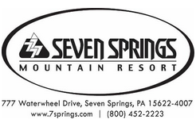

<!--Todo: figure out how to make justified or fit to width in html or markdown-->

[Home](index.md) - [Registration](registration.md) - **Lodging** - [Schedule](schedule.md) - [Nearby Attractions](nearby-attractions.md) - [Group Hikes](group-hikes.md)

# Lodging and Resort Information

**Seven Springs Mountain Resort** will serve as host hotel and base of operations for Konvention PA-22. 

Complementing the Konvention’s official events and programs, the resort offers a wide range of indoor/outdoor activities for the whole family!   You can find out more at: [https://www.7springs.com/summer/adventures/](https://www.7springs.com/summer/adventures/)

Lodging is handled separately from Konvention registration and must be booked independently by attendees, based on their own needs and preferences.  A room block and special group rate have been secured for Konvention guests.

## Group Room Rates (per night)

Slopeside Hotel:
- Lodge Queen — $139
- King or Queen Tower — $149
- Queen Family Room — $169
- King Jr. Family Suite — $179

Rates are for Thursday, Friday, and Saturday (June 23-25) and may be extended for 3 contiguous nights before/after the official program (subject to availability).

Rates quoted do not include local/state taxes, currently 11%.

Room block is limited. Special rates are available on a first-come, first-served basis.

Accomodations Include:
- Free on-site parking
- Complimentary Resort Shuttle Access
- Indoor/Outdoor Pool Access
- On Property Hiking and Biking Trail Access
- Complimentary Wireless Internet Access

## Reservation Instructions

By Phone:
- (800)452.2223 or (814)352.7777, ext.7009
- Please specify that you are requesting the "Highpointers Konvention Rate"

Online:
- [www.7springs.com/lodging/](https://www.7springs.com/lodging/)
- Use Group Code: **8by85i**
