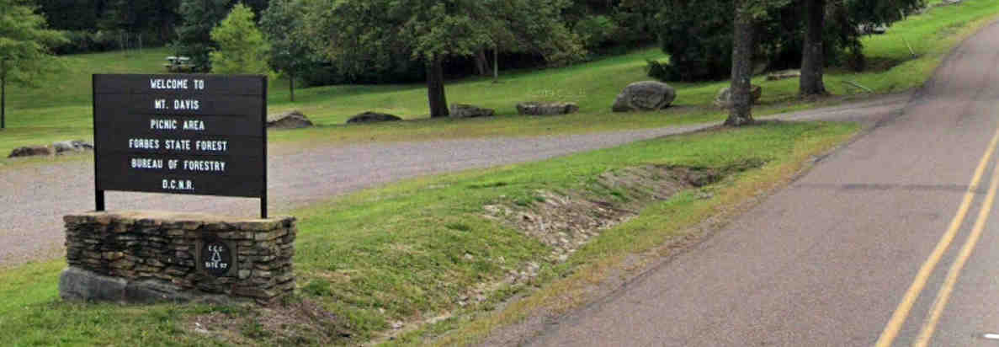

[Home](index.md) - [Registration](registration.md) - [Lodging](lodging.md) - **Schedule** - [Nearby Attractions](nearby-attractions.md) - [Group Hikes](group-hikes.md) 

# Schedule of Konvention Events
_Sunrise is 5:47 am_ 
_Sunset is 8:51 pm_

-----------

# Thursday, June 23

-----------

### 📃 **On-Site Registration Desk and Highpointers’ Shoppe**

Time: Noon - 6 p.m.

Location: Laurel Room \(2nd floor, Convention Center\)

### 🍻 **Liar’s Club Social**

Time: 7 - 10 p.m.

Location: Matterhorn Lounge and Deck \(3rd floor, Main Lodge)

What: A kickoff meet and greet for Konvention PA-22 attendees!  Join outdoor enthusiasts from around the globe for a few remarks, refreshments and lots of conversation about travel and highpointing conquests.  Share your own stories and embellish a little, if you like. At 7:30 p.m., a short presentation will be made by Ron Aldom, Executive Director of the Somerset County Chamber of Commerce, welcoming attendees and providing local information.

> Note: A cash bar will be available.  Food is not served at this location. However, guests are welcome to bring in food, and restuarants within the resort will be open.

-----------

# Friday, June 24

-----------

### 📃 **On-Site Registration Desk and Highpointers’ Shoppe**

Time: 9 a.m. - 2 p.m. \(_Tentatively ending at 2pm. We will likely go later._\)

Location: Laurel Room \(2nd floor, Convention Center\)

### ☕ **Continental Breakfast**

Time: 7 - 8:45 a.m.

Location: Snowflake Room \(3rd floor, Convention Center\)

What: Grab your freshly brewed coffee or tea and a danish or donut. Get ready for a day of exploring and adventure!

## **Daytime Programs (Optional)**

Konvention attendees can choose to explore the Laurel Highlands region on their own, take advantage of [trails](https://ogden-images-pagely.s3.amazonaws.com/www.7springs.com/images/2020/05/SummerTrailGuide_2020_pg1.pdf) and amenities offered at the resort, or participate in [organized hikes](group-hikes.md), outdoor talks, and other activities.

### 🥾 **Somerset County High Point Hike**

Time: leaving from Snowflake Room at 8 a.m.

What: Seven Sprints resort contains the high point of Somerset County, near Lake Tahoe on the summit of the ski slopes. We will be hiking from the resort to the summit and back. Estimated round-trip time is 1.5 hours. Vertical climb is approximately 525 feet over 1.3 miles (one way).

### 🏛 **Flight 93 National Memorial**

Time: meeting there at 11 a.m.

Location: 6424 Lincoln Hwy, Stoystown, PA 15563

What: A group will be going to visit the Flight 93 Memorial after breakfast.  The U.S. Park Service has built a very nice [memorial and visitors center](https://www.nps.gov/flni/index.htm). Expect to spend about an hour here, possibly a little longer.

> Note: The memorial is roughly 30 miles (~45 min drive) east of Seven Springs Resort.

### 👨‍🏫 **Classroom Instruction \(courtesy of Alan Ritter \)**

Time: 1 p.m. - Orienteering
      2:30 p.m. - Basic Climbing Knots

Location: Snowflake Room \(3rd floor, Convention Center\)

What: Alan has graciously volunteered to teach two classes this afternoon. The first will cover orienteering and basic outdoor navigational skills, while the second will cover the basic knots used when climbing.  Each class will last approximately one hour.

### 🥾 **GAP Trail Hike**

Time: 2 p.m.

Location: Meyersdale Area Historical Society, 527 Main St, Meyersdale, PA 15552

What: We will be parking at the Meyersdale Area Historical Society (Trail access is behind their building) and heading southwards along the GAP trail. The planned hike is to travel 3 miles (one way. 6 miles total) south to the Keystone viaduct, then returning north to Meyersdale.  Guests are welcome to join for some or all of this hike!

> Note: This section of the GAP is a very well-maintained trail. It is paved, level, and presents a very easy and enjoyable hike.

For those looking to cover a longer section of the GAP, cycling the trail would be a good idea.  One option would be hopping onto the GAP in Rockwood, near where our next event \(the Post-Hike Recovery Stop\) will be held.  The [Rockwood Bike Shop](http://www.rockwoodtrailhouse.com/bike_shop.htm) \(131 Rockdale Rd, Rockwood, PA 15557\) sits directly adjacent to the GAP trail access, and offers bicycle rentals.  If you choose to use this option, please call the shop ahead of time.  \(We have spoken to the owner and he will be in-and-out some Friday afternoon, but he will definitely be there if anyone is coming to rent.\)

### 🍺 **Post-Hike Recovery Stop**

Time: 4 - 6 p.m.

Location: Trailhead Brewing Company, 402 Main St Suite C, Rockwood, PA 15557

What: It's a long drive back to Seven Springs after that hike, so let's cut it in half with some refreshments at a local brewery.  Feel free to stop in and discuss your GAP adventures! Please note that the brewery opens at 4pm on Friday, so this may be the one time you don't need to get there early!

### 🙋‍♀️🙋‍♂️**Trivia Soiree**

Time: 7 - 10 p.m.

Location: Matterhorn and Deck \(3rd floor, Main Lodge)

What: Join in on the fun and games! Form a team and take part in a "general trivia” session for the whole family, mixed in with some “geo-trivia” questions the hard-core outdoor crowd! Trivia starts at 7:30 p.m. and lasts approximately 1.5 hours.

> Note: A cash bar will be available.  Food is not served at this location. However, guests are welcome to bring in food, and restuarants within the resort will be open.

-----------

# Saturday, June 25

-----------

### 📃 **On-Site Registration Desk and Highpointers’ Shoppe**

Time: TBD \(_Closed in the morning for the Watermelon Fest and Highpoint meetup. Tentatively open in the afternoon. Hours to come._\)

Location: Laurel Room \(2nd floor, Convention Center\)

### 🥞 **Mountain Breakfast**

Time: 7 - 9 a.m.

Location: Slopeside Dining Room \(4th floor, Main Lodge\)

What: Full breakfast, served buffet style. Come fill up before heading out for the day's festivities!

## **Daytime Programs (Optional)**

Konvention attendees can choose to explore the Laurel Highlands region on their own, take advantage of [trails](https://ogden-images-pagely.s3.amazonaws.com/www.7springs.com/images/2020/05/SummerTrailGuide_2020_pg1.pdf) and amenities offered at the resort, or participate in [organized hikes](group-hikes.md), outdoor talks, and other activities.

### 🍉 **Mt. Davis Celebration and Wendy Comstock Watermelon Feast**

Time: 11 a.m.

Location: Mt. Davis, Elk Lick Township, PA 15558

**We recommend leaving Seven Springs by 9:30 a.m. to get to the Watermelon feast in time for group photos.**

What: Konvention attendees will gather at Pennsylvania’s highpoint, Mt. Davis, located in Forbes State Park. Proceedings include a few brief remarks about the highpoint by Rachael Mahony of the PA Department of Conservation and Natural Resources and a traditional watermelon toast, followed by the opportunity to explore the site and interpretive exhibits.  Participants should wear their Konvention T-shirt, as a group photo will be taken. Hiking afterwards is recommended.

**Please consider car-pooling if you can. Do not park on the grass or on the side of the road.** There are 50 parking spaces at the [parking Lot and picnic area **CCC Site 97**"](https://goo.gl/maps/AeG4EXsmWeRRkCQh6) and another 20 spaces at the [smaller parking lot](https://goo.gl/maps/AeG4EXsmWeRRkCQh6). Parking at the CCC Site 97 is recommended.

Please note that there is a short ~1/2 mile hike from the CCC Site 97 lot to the highpoint.

### 🥾 **Forbes State Forest Hike**

Time: Noon

Location: Mt. Davis, Elk Lick Township, PA 15558

What: A hike along the Mt. Davis Pennsylvania Highpoint Trail.  We will have already walked part of this trail from CCC Site 97 to the highpoint.  This hike will leave from the highpoint and follow the trail counter-clockwise around Forbes State Forest, ending back at CCC Site 97. Total distance is approximately 4.5 miles, and should take a little over 2 hours to complete.

### 📷 **Scenic Photo Gallery \(courtesy of James Suits\)**

Time: TBD (afternoon)

Location: Laurel Room \(2nd floor, Convention Center\) \(_*tbd. Awaiting confirmation._\)

What: Come and enjoy scenic photos from around the country!  James will be available to provide some context and talk to you about his travels to all these amazing places.

### 📈 **Highpointers Foundation Meeting**

Time: 12:45 - 2:15 p.m.

Location: Snowflake Room \(3rd floor, Convention Center\)

### 📊 **Highpointers Club Meeting**

Time: 2:30 - 4:30 p.m.

Location: Snowflake Room \(3rd floor, Convention Center\)

### 🍸 **Happy-Hour**

Time: 5 - 6 p.m.

Location: Exhibit Hall \(4th floor, Convention Center\)

### 🍽 **Annual Dinner**

Time: 6 - 9 p.m.

Location: Exhibit Hall \(4th floor, Convention Center\)

What: Wrap up the convention with a celebration of highpointing and the spirit of bringing people together.  The nomination of locations for the 2023 and 2024 Konventions will conducted after dinner! Konvention location elections will be conducted by mail.

# Sunday, June 26

On Sunday morning, the [Slopeside Dining Room](https://ogden_images.s3.amazonaws.com/www.7springs.com/images/2021/01/slopeside-breakfast-113020_web.pdf) will be open on from 7am to 10am for anyone who whishes to order an à la carte breakfast before departing.
